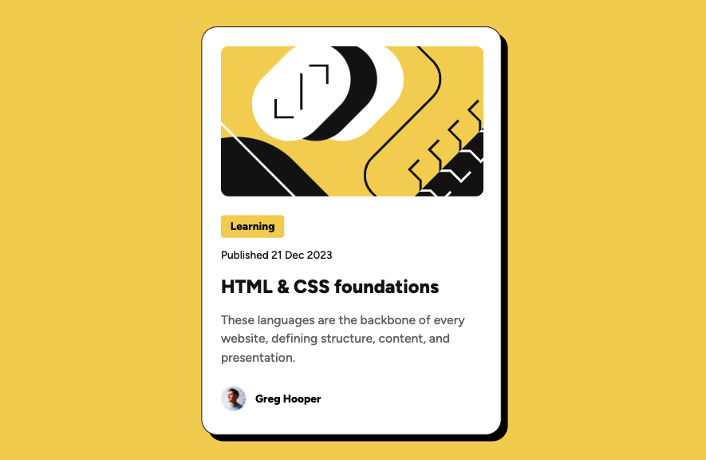
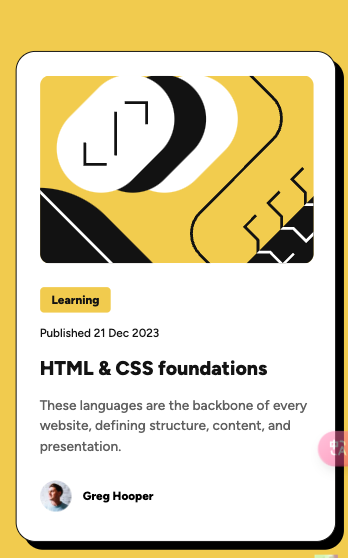

# Frontend Mentor - Blog preview card solution

This is a solution to the [Blog preview card challenge on Frontend Mentor](https://www.frontendmentor.io/challenges/blog-preview-card-ckPaj01IcS). Frontend Mentor challenges help you improve your coding skills by building realistic projects.

## Table of contents

- [Overview](#overview)
  - [The challenge](#the-challenge)
  - [Screenshot](#screenshot)
  - [Links](#links)
- [My process](#my-process)
  - [Built with](#built-with)
  - [What I learned](#what-i-learned)
  - [Continued development](#continued-development)
  - [Useful resources](#useful-resources)

## Overview

### The challenge

Users should be able to:

- See hover and focus states for all interactive elements on the page

### Screenshot





Add a screenshot of your solution. The easiest way to do this is to use Firefox to view your project, right-click the page and select "Take a Screenshot". You can choose either a full-height screenshot or a cropped one based on how long the page is. If it's very long, it might be best to crop it.

Alternatively, you can use a tool like [FireShot](https://getfireshot.com/) to take the screenshot. FireShot has a free option, so you don't need to purchase it.

Then crop/optimize/edit your image however you like, add it to your project, and update the file path in the image above.

**Note: Delete this note and the paragraphs above when you add your screenshot. If you prefer not to add a screenshot, feel free to remove this entire section.**

### Links

- Live Site URL: [here](https://coyoteshkw.github.io/blog-preview-card/)

## My process

### Built with

- Semantic HTML5 markup
- CSS custom properties
- Flexbox layout

### What I learned

- use variables

I realized if I use variable in CSS, it's easier to make my webpage responsive. Example:

```css
:root {
  --font-small: 16px;
  --font-smaller: 14px;
  --font-big: 24px;
}
```

when max-width < 375px, I can modify this to make it done everywhere.

```css
@media screen and (max-width: 375px) {
  :root {
    --font-smaller: 12px;
    --font-small: 14px;
    --font-big: 20px;
  }
}
```

- import local fonts using `@font-face`

I never used it, that's funny. And I found on `src format()` must use **truetype** instead of *ttf*.

```css
@font-face {
  font-family: 'Figtree Medium';
  src: url(./assets/fonts/static/Figtree-Medium.ttf) format('truetype');
  font-weight: normal;
  font-style: normal;
}
```

- serif and **sans-serif** and why use them

sans-serif is easier for people to read and a better choice. Serif is more often used in places with lots of text, such as body text.

- let pic fill the parent element

I don't know why but only

```css
.card__img {
  overflow: hidden;
  border-radius: 10px;
  width: 336px;
  height: 200px;
}

.card__img img {
  object-fit: cover;
  width: 100%;
  height: 100%;
}
```

will work nice. **width, height 100% and object-fit:cover** necessary.

- prepare in advance

I noticed that there may be more than one card__tag and card__author. So I create wrapper just in case.

- border-radius 20/10/5

maybe child element border radius can /2 to make it beautiful.

- use flex(or grid)

I checked the figma design file and found the space is same. So I decide to use `gap` property controlling the space.

**I also tried grid layout because I thought it was a simpler solution, but it gave me unexpected spacing so I gave up.**

### Continued development

1. I **fixed the width and height**, but I'm not sure that's a good solution. And I use flex layout to make my card center, if I cancel the height and width, the width will change when larger the browser.
2. ~~I use `padding-inline` on container, but when I smaller the browser, doesn't work on my card. I do not know why.~~ that's because fixed width and height

### Useful resources

- [@font-face](https://developer.mozilla.org/zh-CN/docs/Web/CSS/@font-face) - This helped me for using local font
